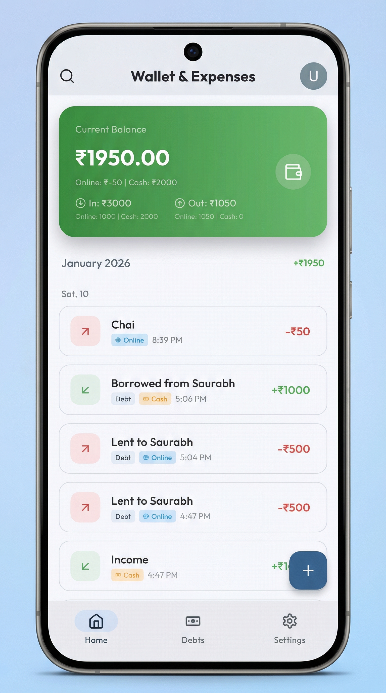
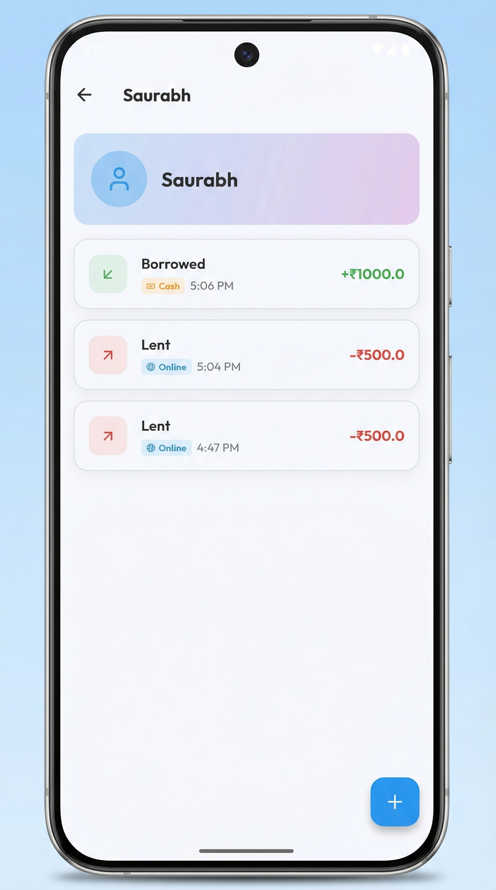
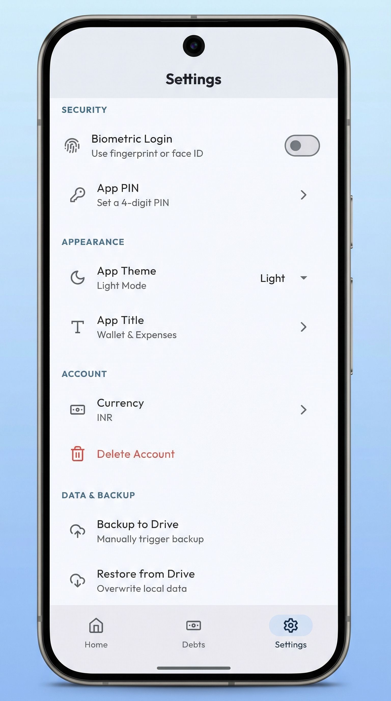

# Wallet & Expenses

A comprehensive personal finance and debt management application. Securely track your income, expenses, and personal debts with robust offline capabilities and automatic cloud synchronization.

## 📥 Download

**[Get the Latest Release (APK)](https://github.com/07-Ansh/Wallet/releases/latest)**

## 🚀 Features

### 💰 Wallet Management
- **Smart Tracking**: Log daily Income and Expenses with ease.
- **Dual Modes**: Distinctly track **Online** (Bank/UPI) and **Cash** (Physical Wallet) balances.
- **Visual Dashboard**: Real-time overview of your financial health with intuitive breakdowns.

### 🤝 Debt Manager
- **People-Centric**: Organize debts by person. Import contacts directly from your phone.
- **Lent & Borrowed**: Clearly see `Who owes you` vs `Who you owe`.
- **Smart Notifications**: Send personalized details and due dates via **WhatsApp** or **SMS** with one tap.
- **Two-Way Sync**: Adding a Debt automatically creates a corresponding Wallet transaction.

### ☁️ Secure Cloud Backup
- **Automatic Sync**: Data is automatically backed up to your personal Google Drive (AppData folder).
- **Encryption**: All backups use **AES-256 encryption**.
- **Silent Restore**: Reinstalling the app? Data restores automatically upon sign-in.

### 🔒 Security & Privacy
- **Biometric Lock**: Secure your data with Fingerprint or Face ID.
- **Local-First**: API-free. Your data lives on your device and your own Google Drive.

## 📱 Screenshots

| Wallet | Debts | Settings |
|:---:|:---:|:---:|
|  |  |  |

## 📄 License

**ALL RIGHTS RESERVED**

Copyright © 2026. This application is free to use but not open source. Unauthorized modification or redistribution is prohibited.
